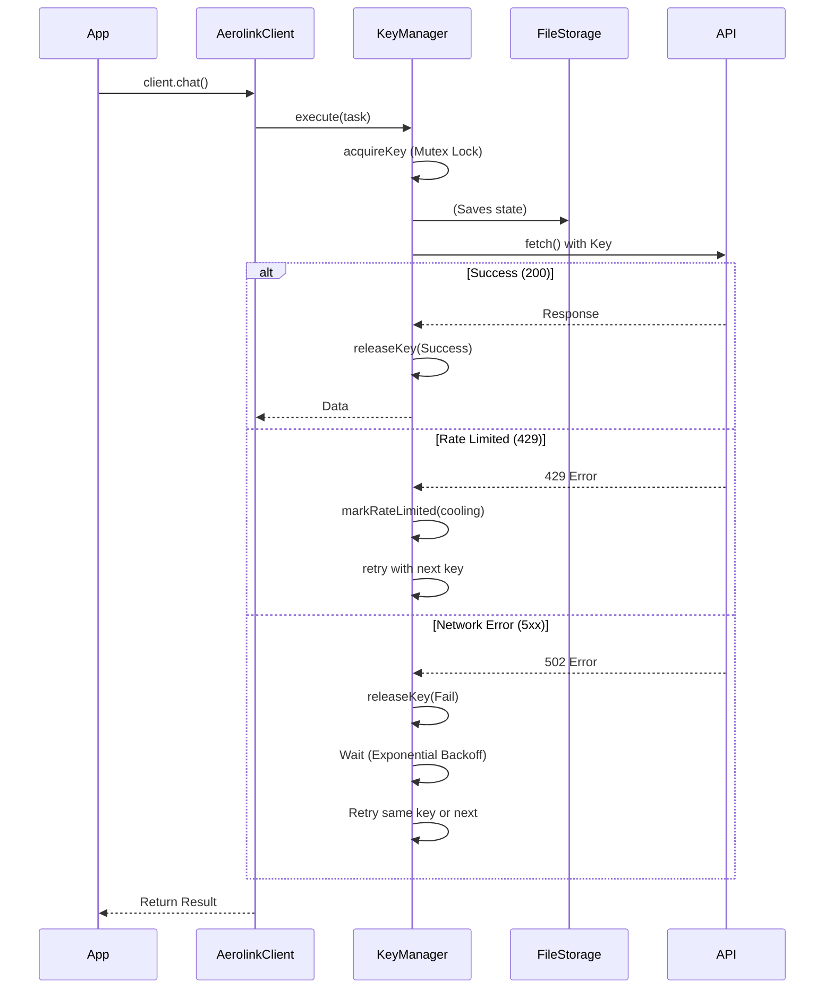

# Aerolink API Key Manager

A production-ready, highly concurrent API Key Manager for Aerolink, featuring weighted round-robin key rotation, rate-limit cooldowns, transient network error retries, and comprehensive CLI tooling.

## Features
- **Concurrent Request Handling**: Utilizes a mutex to ensure keys are safely locked (`busy`) during requests.
- **Smart Rotation**: Weighted round-robin prefers keys with fewer historical requests.
- **Quota & Rate Limit Protection**: Detects 429 Quota errors and gracefully puts keys into a cooling state (automatically parses `x-ratelimit-reset` or `retry-after` headers).
- **Transient Error Backoff**: Retries 500+ errors using exponential backoff with jitter.
- **Extensive CLI**: Monitor health, stats, active cooldowns, or add new keys on the fly.
- **OpenAI-Compatible Client**: A generic `AerolinkClient` that works as a drop-in API client.
- **Pluggable Storage**: Saves state persistently to JSON securely.

## Installation

```bash
cd api-key-manager
npm install
npm run build
```

## Setup Environment

Create a `.env` file from the `.env.example`:
```bash
cp .env.example .env
```
Add your API keys inside using the `AEROLINK_KEY_*` pattern. You can add as many as you want dynamically.

## Integration Example

### Node.js / Next.js Integration

```typescript
import { KeyManager } from 'aerolink-key-manager/src/manager/KeyManager';
import { FileStorage } from 'aerolink-key-manager/src/storage/FileStorage';
import { loadEnvConfig, getBaseUrl, getModel } from 'aerolink-key-manager/src/config/env';
import { AerolinkClient } from 'aerolink-key-manager/src/providers/AerolinkClient';

// Initialize Config and Keys
const { config, keysFromEnv } = loadEnvConfig();
const storage = new FileStorage('keys-state.json');

// Initialize KeyManager
const manager = new KeyManager(storage, config);
await manager.init(keysFromEnv);

// Initialize Client
const client = new AerolinkClient(manager, getBaseUrl(), getModel());

// Use it seamlessly
const response = await client.chat([{ role: 'user', content: 'Hello!' }]);
console.log(response.data);
```

## Architecture

The KeyManager sits between your application and the API provider, intercepting requests to attach the best available API key.



## CLI Usage

The package includes a powerful CLI to manage keys and view statistics.

```bash
# View overall health
npm start health

# View statistics per key (latency, requests, failures, etc)
npm start stats

# List all keys and their status
npm start list

# View which keys are in cooldown
npm start cooldowns

# Test the API
npm start test

# Add a new key locally
npm start add <id> <api_key>

# Reset statistics
npm start reset
```
